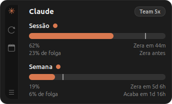

# Claude Usage Monitor

Um card flutuante para Linux que acompanha os limites do Claude Code: a janela
de sessão (5 h) e a semanal (7 dias), com ritmo de consumo e projeção de quando
o limite acaba.



> **In English:** a floating desktop widget for Linux that tracks your Claude Code
> rate limits (5-hour session and 7-day window), showing burn rate and a
> projection of when you'll run out. It reads the same numbers `/usage` shows
> inside Claude Code. GTK 3 + Python 3, no dependencies beyond what Ubuntu ships.
> **The app's interface is in Brazilian Portuguese** — see
> [issue tracker](../../issues) if you'd like i18n.

> **Não é um projeto oficial da Anthropic.** É uma ferramenta independente que
> consome um endpoint interno, não documentado, do Claude Code — ele pode mudar
> ou sair do ar sem aviso.

## De onde vêm os números

Os mesmos que o `/usage` mostra dentro do Claude Code — não são estimativas.
O app lê o token OAuth que o Claude Code já gravou em
`~/.claude/.credentials.json` e consulta `GET https://api.anthropic.com/api/oauth/usage`.
O badge do plano (`Team 5x`) vem do `subscriptionType` + `rateLimitTier` do
mesmo arquivo.

O token é lido a cada consulta (para pegar renovações feitas pelo Claude Code),
nunca é copiado para outro lugar e nunca aparece em log. Se ele expirar, o card
mostra `Login expirado. Rode \`claude\` para renovar.` e continua exibindo o
último valor conhecido, esmaecido.

Nenhum dado sai da sua máquina além da própria chamada à API da Anthropic.

## O que cada campo significa

```
Sessão ●                  ← barra e ponto: laranja / amarelo (75%) / vermelho (90%)
████████████████████│░░   ← barra = % consumido; risco vertical = onde o relógio está
99%              Zera em 44m
14% de déficit   Acaba em 2m
```

- **99%** — utilização informada pela API.
- **14% de déficit** — quanto você gastou além do ritmo linear da janela. Com
  44 min restantes de 5 h, 85% do tempo já passou; gastar 99% é 14 pontos
  acima do ritmo. Gastando abaixo do ritmo aparece como `de folga`.
- **Zera em 44m** — quando a janela reseta (vem da API).
- **Acaba em 2m** — projeção até 100% usando a taxa de queima dos últimos
  45 min. Mostra `Zera antes` quando a janela reseta antes de estourar, e `—`
  enquanto não há amostras suficientes (logo após abrir o app).

## Aviso de limite

Quando uma janela cruza **80%**, o app manda uma notificação de desktop — útil
quando o card está escondido ou atrás de outra janela.

- Dispara **uma vez por ciclo**: ficar horas acima de 80% não gera aviso a cada
  consulta. Rearma quando a janela zera (ou quando o uso cai abaixo do limiar,
  para contas sem `resets_at`).
- Sessão e semana avisam **de forma independente**.
- Acima de 90% a notificação sai com urgência `critical`, que no GNOME fica na
  tela até você fechar.
- Ligar o aviso não gera aviso retroativo: se você ativar já acima do limiar, o
  próximo cruzamento é que notifica.

Mudar o limiar ou desligar:

```bash
./claude-usage-monitor --notify-threshold 90   # avisa em 90%
./claude-usage-monitor --no-notify             # sem aviso
```

O menu (botão direito no card) tem **Alternar aviso de limite**, e as chaves
`notify_enabled` / `notify_threshold` no `config.json` guardam a escolha.

Usa libnotify quando disponível (aí o aviso da mesma janela é atualizado no
lugar de empilhar), com fallback para o binário `notify-send` e, na falta dos
dois, só uma linha de log — o app nunca depende deles.

## Requisitos

- Linux com X11 ou XWayland (veja [Notas de plataforma](#notas-de-plataforma))
- Python 3.9+ e PyGObject/GTK 3 — no Ubuntu/Debian já vêm instalados; se faltar:
  `sudo apt install python3-gi gir1.2-gtk-3.0`
- Claude Code instalado e logado (`claude`), para existir o
  `~/.claude/.credentials.json`

## Instalação

```bash
git clone https://github.com/pettersonPadilha/claude-usage-monitor.git
cd claude-usage-monitor

./claude-usage-monitor          # roda direto
./install.sh                    # registra como aplicativo (menu + ícone)
./install.sh --autostart        # e também inicia junto com a sessão
./install.sh --uninstall        # remove atalho, autostart e ícones
```

`./install.sh` instala o app como qualquer outro (Brave, Chrome…): ícone próprio
no tema hicolor do usuário, entrada em `~/.local/share/applications` e
`StartupWMClass` casando com o `WM_CLASS` da janela — então ele aparece na grade
de aplicativos, pode ser fixado no dock e mostra o ícone certo na barra de
tarefas. Nada disso precisa de `sudo`, e nada é copiado: as entradas apontam
para o diretório onde você clonou.

O ícone é gerado por código (`tools/make_icons.py`, PNG de 16 a 512 px + SVG);
para mudar o desenho, edite esse script e rode `./install.sh` de novo.

### Ícone no painel (opcional)

O indicador de painel precisa de uma biblioteca que não vem instalada:

```bash
sudo apt install gir1.2-ayatanaappindicator3-0.1
# ou: ./install.sh --with-indicator
```

Sem ela o app funciona normalmente, só sem o ícone no painel (o log avisa).

## Uso

- **Arrastar** com o botão esquerdo em qualquer parte do card; a posição é lembrada.
- **Botão direito** ou o ícone ☰ abre o menu: atualizar, mostrar/ocultar a linha
  semanal, alternar "sempre no topo", alternar o aviso de limite, esconder, sair.
- **Fechar** apenas esconde a janela — para encerrar, use *Sair* no menu.

Flags:

```bash
./claude-usage-monitor --interval 120       # intervalo de consulta em segundos (mín. 60)
./claude-usage-monitor --hidden             # inicia escondido (útil com o indicador)
./claude-usage-monitor --no-tray            # sem indicador de painel
./claude-usage-monitor --no-notify          # sem aviso de limite
./claude-usage-monitor --notify-threshold 90  # limiar do aviso em %
./claude-usage-monitor --verbose            # log detalhado
```

## Arquivos

| Caminho | Conteúdo |
|---|---|
| `~/.config/claude-usage-monitor/config.json` | intervalo, posição da janela, preferências |
| `~/.local/share/claude-usage-monitor/history.json` | amostras recentes (usadas para a taxa de queima) |
| `~/.local/share/applications/claude-usage-monitor.desktop` | entrada no menu de aplicativos |
| `~/.local/share/icons/hicolor/*/apps/claude-usage-monitor.*` | ícones instalados |

Chaves do `config.json`: `poll_seconds`, `always_on_top`, `show_week`,
`start_hidden`, `enable_tray`, `show_in_taskbar`, `notify_enabled`,
`notify_threshold`, `window_x`, `window_y`.

### Limite da própria API de uso

O endpoint responde **429** se for consultado com frequência demais (e manda
`retry-after: 0`, que não ajuda). Por isso o padrão é consultar a cada 5 min e,
a cada 429 seguido, o app dobra a espera — 1 min, 2 min, 4 min… até 30 min —
voltando ao normal assim que uma consulta dá certo. Enquanto isso o card segue
mostrando o último valor conhecido, esmaecido.

## Estrutura

```
claude_usage/
  config.py       constantes e settings em disco
  credentials.py  leitura do token OAuth do Claude Code
  api.py          cliente HTTP do endpoint de usage
  model.py        tipos do domínio + parsing do payload
  metrics.py      ritmo, deficit, burn rate, projeções (puro, testado)
  alerts.py       decide quando avisar do limiar (puro, testado)
  history.py      amostras persistidas
  viewmodel.py    monta os textos exibidos
  poller.py       thread de polling
  app.py          orquestração
  ui/             window.py, row.py, bar.py, tray.py, notify.py, style.css
tools/
  preview.py      renderiza o card em PNG (com --live usa dados reais)
  make_icons.py   gera o conjunto de ícones do aplicativo
icons/            ícones gerados (PNG 16-512 + SVG)
tests/            92 testes unitários (unittest, sem dependências)
```

## Testes

```bash
python3 -m unittest discover -s tests -t .
```

A lógica de cálculo (`metrics.py`) e a decisão dos avisos (`alerts.py`) são
puras e cobertas por testes; a UI não é testada automaticamente.

## Notas de plataforma

O app força `GDK_BACKEND=x11` (XWayland): manter janela sempre no topo não é
possível em Wayland puro. O GTK 3 é usado no lugar do GTK 4 pelo mesmo motivo —
e porque o AppIndicator do painel é GTK 3.

Testado no Ubuntu 25.10 (GNOME 49). Deve funcionar em qualquer distro com
GTK 3 e X11/XWayland; relatos de outras distros são bem-vindos nas issues.

## Contribuindo

Issues e PRs são bem-vindos. Antes de abrir um PR, rode os testes e mantenha o
estilo do código existente (tipagem, funções pequenas, sem dependências novas —
a graça do projeto é rodar só com o que a distro já traz).

## Licença

[MIT](LICENSE).
